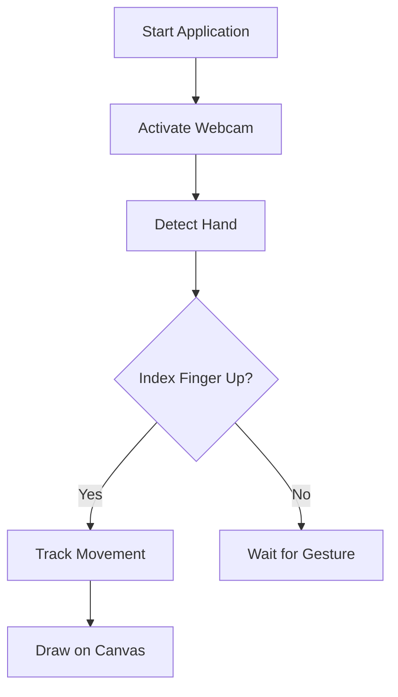

<!-- ========================================================= -->
<!--                    AIR WRITING SYSTEM                     -->
<!-- ========================================================= -->

<div align="center">


<br>


<br><br>

<strong>Real-Time Hand Gesture Based Virtual Drawing using Computer Vision</strong>

<br><br>


</div>

---

# Project Overview

Air Writing System is a real-time computer vision application that enables users to draw in the air using hand gestures captured through a webcam.

The system detects hand landmarks using **MediaPipe** and maps the index finger tip movement onto a virtual canvas using **OpenCV**.

It demonstrates practical implementation of:

- Real-time vision processing  
- Gesture-based interaction  
- Human-Computer Interaction (HCI)  
- AI-based motion tracking  

---

# Technical Details

### Core Concepts Implemented

- Real-time video frame capture  
- 21-point hand landmark detection  
- Gesture-based event triggering  
- Finger coordinate mapping to 2D canvas  
- Object-Oriented Python design  

---

# Key Features

- Real-time hand tracking  
- Index finger drawing mechanism  
- Clear screen functionality  
- Smooth stroke rendering  
- Low latency processing  
- Lightweight architecture  

---

# System Architecture


---

# Workflow



---

# Technology Stack

| Technology | Purpose |
|------------|----------|
| Python 3.11 | Core language |
| OpenCV | Video capture & drawing engine |
| MediaPipe 0.10.9 | Hand tracking & landmark detection |
| NumPy | Numerical operations |

---

# Project Structure

```
air-writing-system/
│
├── main.py
├── hand_tracking.py
├── ui_utils.py
└── README.md
```

---

# Installation Guide

### Clone Repository

```
git clone https://github.com/your-username/air-writing-system.git
cd air-writing-system
```

### Create Virtual Environment

```
python -m venv venv
```

### Activate Environment

Windows:
```
venv\Scripts\activate
```

Mac/Linux:
```
source venv/bin/activate
```

### Install Dependencies

```
pip install opencv-python
pip install mediapipe==0.10.9
pip install numpy
```

---

# Run the Application

```
python main.py
```

Ensure your webcam is enabled.

---

# Future Enhancements

- Save drawing as image  
- Add color selection gestures  
- Implement eraser mode  
- Improve gesture classification  
- Integrate handwriting recognition model  
- Multi-hand support  

---

# Commit Guide

To maintain a clean and professional repository, this project follows the Conventional Commits standard.

This ensures:
- Clear version history
- Structured commit tracking
- Professional collaboration
- Improved readability

---

## Commit Message Format

```
<type>: <short description>

[optional body]

[optional footer]
```

---

## Commit Types

| Type     | Purpose |
|----------|----------|
| feat     | New feature |
| fix      | Bug fix |
| docs     | Documentation updates |
| style    | Code formatting (no logic change) |
| refactor | Code restructuring without changing functionality |
| perf     | Performance improvements |
| test     | Adding or updating tests |
| chore    | Maintenance tasks |
| build    | Dependency or build system changes |
| ci       | CI/CD configuration changes |

---

## Examples

### Adding a new feature
```
feat: add multi-hand tracking support
```

### Fixing a bug
```
fix: resolve index finger tracking lag
```

### Updating documentation
```
docs: update installation instructions
```

### Refactoring code
```
refactor: optimize landmark detection pipeline
```

---

## Branch Naming Convention

```
feature/hand-gesture-improvement
fix/canvas-render-issue
docs/readme-update
refactor/performance-enhancement
```

---

## Contribution Workflow


---

## Pull Request Guidelines

- Keep pull requests focused on a single feature or fix
- Follow the commit message format
- Ensure the project runs without errors
- Update documentation if required
- Maintain clean and readable code

---

## Versioning Strategy

This project follows Semantic Versioning (SemVer):

```
MAJOR.MINOR.PATCH
```

| Version Part | Meaning |
|--------------|----------|
| MAJOR | Breaking changes |
| MINOR | New features |
| PATCH | Bug fixes |

Example:
```
v1.2.3
```

---

## Best Practices

- Write meaningful commit messages
- Avoid large unrelated commits
- Test before pushing
- Use descriptive branch names
- Keep commits atomic and focused

---

# Author

Iqra Fatima  
Computer Science Student  
Specialisation in Artificial Intelligence  

Artificial Intelligence • Computer Vision • Real-Time Vision Systems  

---

# License

This project is open-source and available under the MIT License.

---

<div align="center">


</div>
